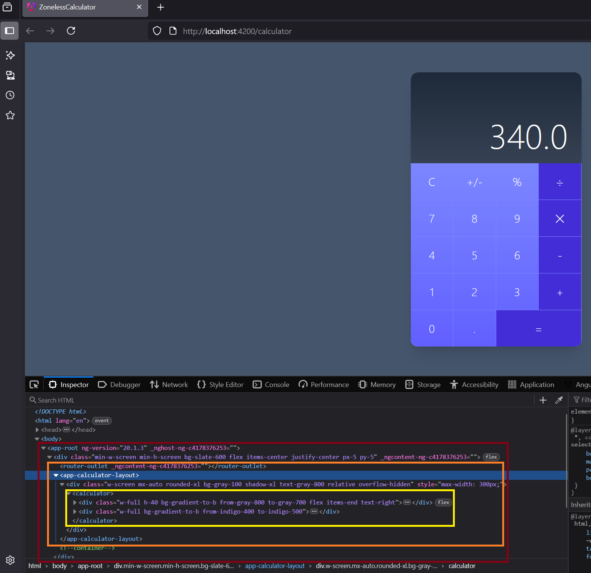

# Índice

1. [¿Qué es el host element?](#qué-es-el-host-element)
2. [Importancia del host element](#importancia-del-host-element)
3. [Otras formas de acceso al host element](#otras-formas-de-acceso-al-host-element)
4. [¿Y qué pasa con `<router-outlet>`?](#y-qué-pasa-con-router-outlet)
5. [Resumen](#resumen)
6. [Ejemplo práctico de host element](#ejemplo-práctico-de-host-element)

---

# Host element

En Angular, el **host element** (elemento host) es el **elemento DOM** donde se monta o inserta un componente.

---

## ¿Qué es el host element?

Cuando defines un componente Angular, por ejemplo:

```ts
@Component({
  selector: 'app-mi-componente',
  template: `<p>Hola mundo</p>`
})
export class MiComponente {}
```

y lo usas en el HTML:

```html
<app-mi-componente></app-mi-componente>
```

El `<app-mi-componente>` es el **host element**. Angular reemplaza su contenido con el template del componente, pero el elemento en sí es el host.

---

## Importancia del host element

* Es el **contenedor** físico donde Angular renderiza el componente.
* Se puede acceder a él en el código del componente usando `ElementRef`:

```ts
constructor(private elRef: ElementRef) {
  console.log(this.elRef.nativeElement); // Aquí está el host element del componente
}
```

* Las directivas y estilos pueden aplicarse directamente al host element.
* También es la base para aplicar decoradores y bindings especiales como `@HostBinding()` y `@HostListener()`.

#### Ejemplo

```ts
import { Component, ElementRef, OnInit, Renderer2 } from '@angular/core';

@Component({
  selector: 'app-mi-componente',
  template: `<p>Componente con fondo dinámico</p>`
})
export class MiComponenteComponent implements OnInit {
  constructor(
    private elRef: ElementRef,
    private renderer: Renderer2
  ) {}

  ngOnInit() {
    // Cambiar el color de fondo del host element
    // Correcto con Renderer2
    this.renderer.setStyle(this.elRef.nativeElement, 'background-color', 'lightblue');

    // NO RECOMENDADO: acceso directo al DOM
    // this.elRef.nativeElement.style.backgroundColor = 'lightblue';
  }
}
```
Donde:
- Si defines esto dentro de CalculatorComponent, cambiará el estilo del `<calculator>` (el host del componente CalculatorComponent).
- No afecta al host del padre como `<app-calculator-layout>`.
- Tampoco afecta al `<router-outlet>`, que simplemente actúa como punto de inyección de la instancia del componente, pero no es su host real.

---

## Otras formas de acceso al host element

* Cambiar clases o estilos en el host element con `@HostBinding`:

```ts
@HostBinding('class.active') isActive = true;
```
> Ejemplo
> ```ts
> @Component({
>   selector: 'app-toggle-btn',
>   template: `<button (click)="toggle()">Toggle</button>`
> })
> export class ToggleBtnComponent {
>   @HostBinding('class.active') isActive = false;
> 
>   toggle() {
>     this.isActive = !this.isActive;
>   }
> }
> ```
> Donde:
> - Cuando uses el `<app-toggle-btn></app-toggle-btn>` recibirá la clase **active** automáticamente cuando **isActive** sea **true**.
> - `@HostBinding('class.active')`: le dice a Angular que ligue la clase CSS **active** al host element.
> - Si `isActive = true;`: Angular agrega la clase *active* al elemento host del componente.
> - Si `isActive = false;`: Angular quitará la clase *active* del host element.

* Escuchar eventos en el host element con `@HostListener`:

```ts
@HostListener('click') onClick() {
  console.log('Host element clicked');
}
```

---

## ¿Y qué pasa con `<router-outlet>`?

Cuando usas rutas en Angular, el `<router-outlet>` actúa como un **punto de anclaje** donde Angular inserta dinámicamente el componente correspondiente a la ruta activa.

Por ejemplo, si tienes:

```html
<router-outlet></router-outlet>
```

Y la ruta activa carga `CalculatorLayoutComponent`, Angular insertará:

```html
<app-calculator-layout>...</app-calculator-layout>
```

Justo después del `<router-outlet>` (aunque visualmente puede parecer que lo reemplaza). Ese `<app-calculator-layout>` es el nuevo **host element** para ese componente.

Entonces:

* El `router-outlet` no es el host del componente insertado, pero sí su contenedor lógico.
* El host real sigue siendo el selector del componente insertado (`<app-calculator-layout>`).

---

## Resumen

| Término           | Definición                                                           |
| ----------------- | -------------------------------------------------------------------- |
| Host element      | Elemento DOM donde se monta el componente Angular.                   |
| `ElementRef`      | Referencia al host element dentro del componente.                    |
| `@HostBinding()`  | Permite enlazar propiedades o atributos al host.                     |
| `@HostListener()` | Permite escuchar eventos en el host element.                         |
| `router-outlet`   | Punto donde Angular inserta dinámicamente componentes según la ruta. |

---

## Ejemplo práctico de host element



En el HTML se observa este fragmento:

```html
<router-outlet _ngcontent-ng-c4178376253=""></router-outlet>
<app-calculator-layout>...</app-calculator-layout>
```

Esto indica que Angular no elimina el elemento `<router-outlet>`, sino que lo utiliza como punto de anclaje para renderizar dinámicamente el componente de la ruta activa. En este caso, está montando:

```html
<app-calculator-layout>...</app-calculator-layout>
```

Justo después de `<router-outlet>`.

Entonces, `<app-calculator-layout>` es el host element del componente de ruta, el cual se inyecta después del `<router-outlet>`, y no lo reemplaza completamente (_esto es un detalle interno de implementación y puede variar, pero funcionalmente actúa como reemplazo_).

Seguidamente se muestra el contenido y se detecta `<calculator>`, que corresponde a otro host element del componente `Calculator`.

✅ En resumen:
- El host element del componente cargado por ruta (como `<app-calculator-layout>`) es insertado dinámicamente por Angular.
- Ese host element se convierte en hijo de `<router-outlet>` o es adyacente, dependiendo del renderizado final.
- El cual tiene otro host element hijo `<calculator>`.

En cualquier **host element** se pueden seguir usando `@HostBinding`, `@HostListener` y `ElementRef` dentro de ese componente como en cualquier otro.

---

## Host element como uno interno

Para que el host element de un componente Angular sea el mismo que uno interno (por ejemplo, para evitar elementos intermedios innecesarios como <app-xyz> en el DOM), puedes hacer lo siguiente:

1. Usar el selector como directiva estructural (_solo si es una directiva, no un compoennte_).
```ts
@Directive({
  selector: '[appHighlight]'
})
export class HighlightDirective {
  constructor(private el: ElementRef) {
    // El host es el <div> o el elemento al que se aplica la directiva
  }
}
```
En el html:
```html
<div appHighlight>Texto resaltado</div>
```
En este caso, no hay nuevo host element, solo se adorna el existente.

2. Para componentes, usar host: {...} en el decorador (**opción recomendad**), que permite añadir atributos persoanlizadiso, clase, al propio host element.
```ts
@Component({
  selector: 'calculator',
  templateUrl: './calculator.component.html',
  styles: '',
  // añade al host element, la case, sin neceisada del añadir un div, es decir, en <calculator clas='ro...'></calculator>
  host:{
    'class': 'rounded shadow p-4'
    // atributos personalizados
    'attribute': 'hola',
    'data-size': 'XL'
  }
})
export class CalculatorComponent implements OnInit {

  //..
}

```
Esto agrega la clase al host element, pero no elimina `<calculator class=''rounded shadow p-4' attribute='hola'> ..contenido </calculator>`

3. Utilizar el elemento **<ng-container>** , para usar estructuras de control como *ngIf, *ngFor u otras directivas estructurales, ya que es invisible en el DOM y útil para evitar elementos envolventes:
```ts
<ng-container *ngIf="visible">
  <calculator></calculator>
</ng-container>
```

- **No** se **renderiza** en el **DOM** (es invisible).
- Solo sirve como envoltorio lógico para directivas estructurales.
- El <calculator> se convertirá en el host element directamente si visible es true.
- Si usas un <div> o un <span>, eso se renderiza en el DOM y puede romper el diseño o alterar el árbol de componentes.

### 🚫 Lo que no se puede hacer directamente:
Angular no permite que el host element de un componente "desaparezca" o se convierta en otro DOM nativo (como reemplazar <calculator> con un <div> automáticamente), a diferencia de frameworks como Vue (<component :is="...">) o React (Fragment).

