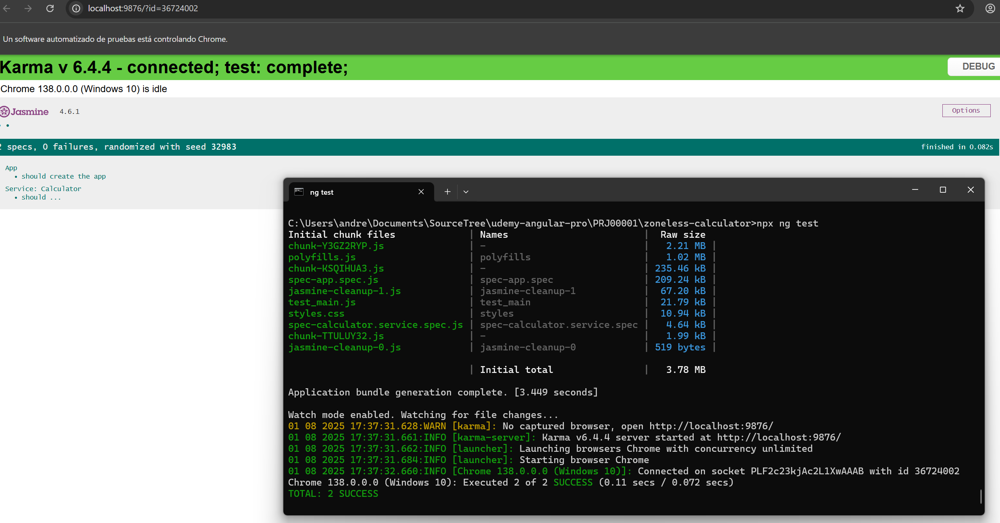
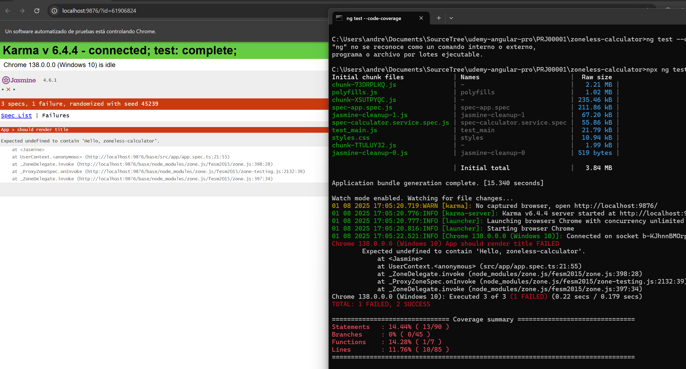
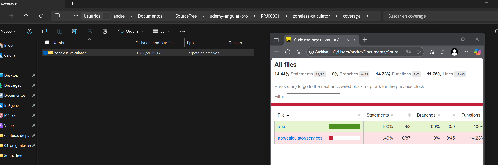

# Configuración de Jasmine y Karma en Angular

Guía para **configurar y ejecutar pruebas en Angular** usando **Karma** y **Jasmine**, el sistema de testing predeterminado en proyectos creados con Angular CLI.

---

## 📚 Índice

1. [¿Qué son Karma y Jasmine?](#1-qué-son-karma-y-jasmine)
2. [Dependencias en `package.json`](#2-dependencias-en-packagejson)
3. [Archivos clave de configuración](#3-archivos-clave-de-configuración)

   * [3.1 `angular.json`](#31-angularjson)
   * [3.2 `karma.conf.js`](#32-karmaconfjs)
   * [3.3 `tsconfig.spec.json`](#33-tsconfigspecjson)
   * [3.4 `test.ts`](#34-testts) (opcional)
4. [Cómo ejecutar pruebas](#4-cómo-ejecutar-pruebas)
5. [Ver cobertura de código](#5-ver-cobertura-de-código)
6. [Errores comunes y solución](#6-errores-comunes-y-solución)
7. [Integración continua (CI)](#7-integración-continua-ci)
8. [Comparativa: Karma/Jasmine vs Jest](#8-comparativa-karmajasmine-vs-jest)
9. [Más información](#9-más-información)

---

## 🧩 1. ¿Qué son Karma y Jasmine?

| Herramienta | Función principal                                |
| ----------- | ------------------------------------------------ |
| **Jasmine** | Framework de pruebas (describe, it, expect, etc) |
| **Karma**   | Test runner que ejecuta Jasmine en el navegador  |

> ⚠️ En proyectos creados con `--standalone` o `--minimal` (Angular 17+), **no se incluye configuración de pruebas por defecto** aunque `karma` y `jasmine` estén en las dependencias.

---

## 📦 2. Dependencias en `package.json`

Ejemplo de dependencias relacionadas con testing:

```json
{
  "@types/jasmine": "~5.1.0",
  "jasmine-core": "~5.8.0",
  "karma": "~6.4.0",
  "karma-chrome-launcher": "~3.2.0",
  "karma-coverage": "~2.2.0",
  "karma-jasmine": "~5.1.0",
  "karma-jasmine-html-reporter": "~2.1.0"
}
```

---

## ⚙️ 3. Archivos clave de configuración

### 3.1 `angular.json`

Fragmento básico:

```json
"test": {
  "builder": "@angular-devkit/build-angular:karma",
  "options": {
    "main": "src/test.ts",
    "polyfills": "src/polyfills.ts",
    "tsConfig": "tsconfig.spec.json",
    "karmaConfig": "karma.conf.js",
    "assets": ["src/favicon.ico", "src/assets"],
    "styles": ["src/styles.css"],
    "scripts": []
  }
}
```

Alternativa moderna (sin `karma.conf.js`):

```json
"test": {
  "builder": "@angular/build:karma",
  "options": {
    "polyfills": ["zone.js", "zone.js/testing"],
    "tsConfig": "tsconfig.spec.json",
    "assets": [{ "glob": "**/*", "input": "public" }],
    "styles": ["src/styles.css"]
  }
}
```

---

### 3.2 `karma.conf.js`

Archivo clásico para configurar Karma:

```js
module.exports = function (config) {
  config.set({
    basePath: '',
    frameworks: ['jasmine', '@angular-devkit/build-angular'],
    plugins: [
      require('karma-jasmine'),
      require('karma-chrome-launcher'),
      require('karma-jasmine-html-reporter'),
      require('karma-coverage'),
      require('@angular-devkit/build-angular/plugins/karma'),
    ],
    client: {
      jasmine: {},
      clearContext: false
    },
    coverageReporter: {
      dir: require('path').join(__dirname, './coverage'),
      subdir: '.',
      reporters: [{ type: 'html' }, { type: 'text-summary' }]
    },
    reporters: ['progress', 'kjhtml'],
    port: 9876,
    colors: true,
    logLevel: config.LOG_INFO,
    autoWatch: true,
    browsers: ['Chrome'],
    singleRun: false,
    restartOnFileChange: true
  });
};
```

---

### 3.3 `tsconfig.spec.json`

Versión básica:

```json
{
  "extends": "./tsconfig.json",
  "compilerOptions": {
    "outDir": "./out-tsc/spec",
    "types": ["jasmine", "node"]
  },
  "files": ["src/test.ts"],
  "include": ["src/**/*.spec.ts", "src/**/*.d.ts"]
}
```

Alternativa más genérica:

```json
{
  "extends": "./tsconfig.json",
  "compilerOptions": {
    "outDir": "./out-tsc/spec",
    "types": ["jasmine"]
  },
  "include": ["src/**/*.ts"]
}
```

---

### 3.4 `test.ts` (opcional)

Archivo de arranque de pruebas, cuando se utiliza una aplicaion modular:

```ts
import 'zone.js/testing';
import { getTestBed } from '@angular/core/testing';
import {
  BrowserDynamicTestingModule,
  platformBrowserDynamicTesting
} from '@angular/platform-browser-dynamic/testing';

declare const require: {
  context(path: string, deep?: boolean, filter?: RegExp): {
    keys(): string[];
    <T>(id: string): T;
  };
};

getTestBed().initTestEnvironment(
  BrowserDynamicTestingModule,
  platformBrowserDynamicTesting(),
);

const context = require.context('./', true, /\.spec\.ts$/);
context.keys().forEach(context);
```

---

## ▶️ 4. Cómo ejecutar pruebas

```bash
ng test
```

Este comando:

* Compila el proyecto
* Abre Chrome
* Ejecuta todos los archivos `.spec.ts`
* Muestra resultados en el navegador

[Text img](./imgs/npx-ng-test.png)

Ejemplo de text pasado:



---

## 📈 5. Ver cobertura de código

```bash
ng test --code-coverage
```



Esto nos generará una archivos en el proyecto ubidacos en en `coverage`, abre el `index.html`, que nos indica que se ha probado y que no.



---

## 🐛 6. Errores comunes y solución

| Problema                             | Solución                                  |
| ------------------------------------ | ----------------------------------------- |
| Chrome no se abre                    | Verifica que Chrome esté instalado        |
| Pruebas no se ejecutan               | Revisa `test.ts` y `tsconfig.spec.json`   |
| `describe` o `expect` no reconocidos | Asegúrate de tener `"types": ["jasmine"]` |
| No encuentra archivos `.spec.ts`     | Verifica rutas en `test.ts`               |

---

## 🤖 7. Integración continua (CI)

Para ejecutar las pruebas sin abrir navegador:

```bash
ng test --no-watch --no-progress --browsers=ChromeHeadless
```
> Nota: Esto puede dar un error si se ejecuta en un contenedor CI / Docker,
> `Running as root without --no-sandbox is not supported. See ...`
> Esto inndica que ChromeHeadless no puede iniciarse porque estás ejecutando el contenedor como root y sin la opción --no-sandbox, lo cual Chrome no permite por seguridad, ver **Integración continua (CI) en Docker**.

[Text img](./imgs/npm-test.png)

Y para asegurar que se construye la aplicacion y pase los test, modificar el**Script en `package.json`:**

```json
"scripts": {
  "build": "npm test && ng build",
  "test": "ng test --no-watch --no-progress --browsers=ChromeHeadless"
}
```

[Text img](./imgs/npm-run-build.png)

### 🤖 7.1. Integración continua (CI) en Docker

**Importante** Para usar los test en un contendor Docker, se debe añadir el argumento `--no-sandbox`,  en `karma.conf.js` y modificar el comando que se ejucuta cuando se invoca los test (_no hace falta modificar tsconfig.spcec.json_)

Modificar el **script** del `package.json`, para ustar la configuración `ChromeHeadlessNoSandbox`
```json
// package.json
"scripts": {
  "build": "npm test && ng build",
  "test": "ng test --no-watch --no-progress --browsers=ChromeHeadlessNoSandbox"
}
```

Crear o modidiar el fiechero `karma.conf.js` ubicado en la raíz de la aplicación Angular.

```js
// karma.conf.js
// No hace falta modificar tsconfing.spec.json
module.exports = function (config) {
  config.set({
    basePath: '',
    frameworks: ['jasmine', '@angular-devkit/build-angular'],
    plugins: [
      require('karma-jasmine'),
      require('karma-chrome-launcher'),
      require('karma-jasmine-html-reporter'),
      require('karma-coverage'),
      require('@angular-devkit/build-angular/plugins/karma'),
    ],
    client: {
      jasmine: {
        // Aquí puedes configurar opciones de Jasmine si necesitas
      },
      clearContext: false // deja los resultados visibles en el navegador
    },
    reporters: ['progress', 'kjhtml'],
    port: 9876,
    colors: true,
    logLevel: config.LOG_INFO,
    autoWatch: true,

    // ✅ Usamos una versión personalizada de ChromeHeadless que funciona en Docker
    browsers: ['ChromeHeadlessNoSandbox'],
    customLaunchers: {
      ChromeHeadlessNoSandbox: {
        base: 'ChromeHeadless',
        flags: [
          '--no-sandbox',           // ✅ Necesario en contenedores Docker
          '--disable-gpu',
          '--disable-dev-shm-usage',
          '--disable-setuid-sandbox',
          '--remote-debugging-port=9222'
        ]
      }
    },

    // ✅ Mantén esto en false si quieres que Karma siga ejecutándose
    singleRun: false,
    restartOnFileChange: true,

    // ✅ Cobertura de código (si usas ng test --code-coverage)
    coverageReporter: {
      dir: require('path').join(__dirname, './coverage'),
      subdir: '.',
      reporters: [
        { type: 'html' },
        { type: 'text-summary' }
      ]
    }
  });
};
```


Para ejcutar:

```bash
# En el path donde esta el docker-compose.yml
docker compose up --build angular-prod
```

- Esperar a que se descarge la imange, se pase los test y se inice el contenedor
- Abrir navegador: http://localhost:80

---

## ⚖️ 8. Comparativa: Karma/Jasmine vs Jest

| Sistema             | Por defecto | Velocidad | Configuración | Comunidad Angular |
| ------------------- | ----------- | --------- | ------------- | ----------------- |
| **Karma + Jasmine** | ✅ Sí        | 🐢 Lento  | Compleja      | Muy amplia        |
| **Jest**            | ❌ No        | ⚡ Rápido  | Sencilla      | Menos usada       |

### Para usar Jest:

```bash
ng add @angular-builders/jest
```

Esto:

* Reemplaza Karma + Jasmine por Jest
* Usa otro sistema de configuración
* No requiere `zone.js` ni `karma.conf.js`

---

## 📖 9. Más información

* [Guía oficial de Angular: Testing](https://angular.dev/guide/testing)

---
