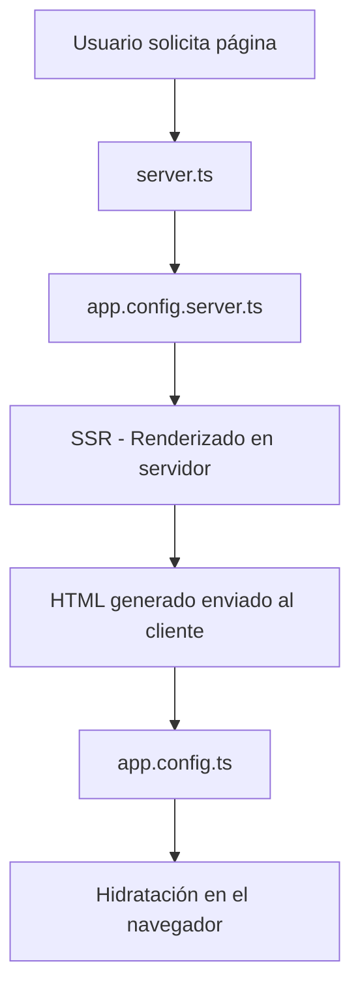

# Angular SSR: Archivos de configuracion CLIENTE & SERVIDOR.

# Índices
[1](#el-archvio-appconfingserverts)
[1.1](#-para-qué-sirve-appconfingserverts)
[1.2](#-cuándo-se-usa-este-archivo)
[1.3](#-resumen-corto)

[2](#diferencias-entre-appconfingts-y-appconfigserverts)
[2.1](#-appconfigts---configuración-del-cliente)
[2.2](#️-appconfigserverts---configuración-del-servidor)
[2.3](#-flujo-de-ejecución)
[2.3.a](#1-primera-carga-ssr)
[2.3.b](#2-hidratación-cliente)

[3. Casos de uso específicos](#--casos-de-uso-específicos)
[3.1](#carga-api-princiaplee-appconfigts-cliente)
[3.2](#compatibilidad-con-ssr--carga-api-en-appconfigserverts-servidor)

[4. Providers compartidos vs específicos](#️-providers-compartidos-vs-específicos)
[4.1 ¿Cómo verificar que se hereda](#como-verificar-qué-se-hereda)
[4.1.a Por ubicación del provider](#por-ubicación-del-provider)
[4.1.b Por compatiblidad de plataforma](#por-compatibilidad-de-plataforma)
[4.2 Ejemplo prácico: Servico que funcion en ambos](#-ejemplo-práctico-servicio-que-funciona-en-ambos)
[4.2.a](#-propósito-acceso-seguro-a-window-en-ssr)
[4.2.a.i](#uso-de-isplatformbrowser)
[4.2.a.ii](#qué-pasa-si-defines-el-provider-window-en-appconfigserverts)
[4.2.a.iii](#pero-que-pasa-si-un-provider-no-esta-definido-en-el-servidor-que-hacer)
[4.3 ¿Cómo saber si un provider debe ir en base o servidor?](#-cómo-saber-si-un-provider-debe-ir-en-base-o-servidor)
[4.3.a En el cliente](#-va-en-appconfigts-se-hereda-si)
[4.3.b En el servidor](#-va-en-appconfigserverts-no-se-hereda-si)
[4.4 Resumen de compatibilidades CLIENTE - SERVIDOR (SSR)](#-resumen-de-compatiblidades-cliente---servidor-ssr)
[4.5 Lista de providers comunes y sus compatibilidades](#-lista-de-providers-comunes-y-su-compatibilidad)
[4.5.a](#-navegador--servidor-compatible)
[4.5.b](#️-solo-servidor)
[4.5.c](#-solo-cliente)

--- 

# El archvio "app.confing.server.ts"

En **Angular 20 con SSR (Server-Side Rendering)**, el archivo **`serverConfig.ts`** es un archivo de configuración que Angular introdujo recientemente para **personalizar el comportamiento del servidor SSR** sin tener que modificar directamente el servidor Node generado por Angular.

## ✅ **¿Para qué sirve `app.confing.server.ts`?**

Es un archivo donde puedes definir configuraciones específicas para el entorno SSR, por ejemplo:

* middlewares personalizados
* control de rutas del servidor
* manejo de cabeceras HTTP
* reglas de caching
* configuración de prerender
* extensiones al servidor Express (o el runtime que use Angular)

> Nota: Antes, tenías que editar `server.ts` manualmente; ahora Angular separa la configuración en `serverConfig.ts` para mantener el proyecto más limpio.

📄 **Ejemplo típico de `serverConfig.ts` en Angular 18–20**

```ts
import { defineServerConfig } from '@angular/ssr';

export default defineServerConfig({
  middleware: [
    (req, res, next) => {
      console.log('SSR request:', req.url);
      next();
    },
  ],
});
```

## 🚀 ¿Cuándo se usa este archivo?

Cuando corres SSR:

```
ng serve
ng run proyecto:serve-ssr
ng build --ssr
```

Angular lee `serverConfig.ts` y aplica esas configuraciones al servidor que renderiza la app.

## 📌 Resumen corto

**`serverConfig.ts` = archivo de configuración del servidor SSR en Angular 20.
Permite personalizar el servidor sin tocar el código del motor SSR generado automáticamente.**

---

# Diferencias entre `app.confing.ts` y `app.config.server.ts`

Resumen comparativo: 

| Aspecto | `app.config.ts` | `app.config.server.ts` |
|---------|----------------|----------------------|
| **Entorno** | Cliente (Browser) | Servidor (Node.js) |
| **Cuándo se ejecuta** | En el navegador | Durante el SSR |
| **Providers** | Para funcionalidad del cliente | Para funcionalidad del servidor |
| **APIs disponibles** | DOM, Window, localStorage | Node.js, Request, Response |

Por tanto:_
* **app.config.ts** → configuración compartida (_cliente + SSR_)
* **app.config.server.ts** → configuración solo del servidor SSR

## 🌐 **`app.config.ts` - Configuración del Cliente**

**Se ejecuta en el navegador** después de la hidratación:

````typescript
// app.config.ts
import { ApplicationConfig, provideZoneChangeDetection } from '@angular/core';
import { provideRouter } from '@angular/router';
import { provideHttpClient, withInterceptorsFromDi } from '@angular/common/http';
import { provideAnimations } from '@angular/platform-browser/animations';

export const appConfig: ApplicationConfig = {
  providers: [
    // ⚡ Configuración para el NAVEGADOR
    provideZoneChangeDetection({ eventCoalescing: true }),
    provideRouter(routes),
    provideHttpClient(withInterceptorsFromDi()),
    provideAnimations(),
    
    // 🍪 Cookies del cliente
    CookieService,
    
    // 💾 Storage del navegador
    { provide: 'BROWSER_STORAGE', useValue: localStorage },
    
    // 🌍 Geolocalización
    { provide: 'GEOLOCATION', useValue: navigator.geolocation },
    
    // 📱 APIs del navegador
    { provide: 'WINDOW', useValue: window },
    { provide: 'DOCUMENT', useValue: document }
  ]
};
````

> Para descubrir que son: Ver [16-3-b-inyeccion-api-borser-como-providers](#)
> ```json
> // 🌍 Geolocalización
> { provide: 'GEOLOCATION', useValue: navigator.geolocation },
> 
> // 📱 APIs del navegador
> { provide: 'WINDOW', useValue: window },
> { provide: 'DOCUMENT', useValue: document } 
>```
> 

## 🖥️ **app.config.server.ts - Configuración del Servidor**

**Se ejecuta en Node.js** durante el renderizado inicial:

````typescript
// app.config.server.ts
import { mergeApplicationConfig, ApplicationConfig } from '@angular/core';
import { provideServerRendering, withRoutes } from '@angular/ssr';
import { REQUEST, RESPONSE } from '@angular/ssr/tokens';

const serverConfig: ApplicationConfig = {
  providers: [
    // 🏗️ Configuración para el SERVIDOR
    provideServerRendering(withRoutes(serverRoutes)),
    
    // 🌐 Request/Response del servidor
    { provide: 'REQUEST', useFactory: () => inject(REQUEST, { optional: true }) },
    { provide: 'RESPONSE', useFactory: () => inject(RESPONSE, { optional: true }) },
    
    // 🗄️ Base de datos (solo servidor)
    { provide: 'DATABASE_URL', useValue: process.env['DATABASE_URL'] },
    
    // 🔐 Variables de entorno seguras
    { provide: 'API_SECRET', useValue: process.env['API_SECRET'] },
    
    // 📂 Sistema de archivos
    { provide: 'FILE_SYSTEM', useValue: require('fs') }
  ]
};

// ⚙️ MERGE: Combina ambas configuraciones
export const config = mergeApplicationConfig(appConfig, serverConfig);
````

## 🔄 **Flujo de ejecución**



### **1. Primera carga (SSR)**
```typescript
// ✅ Se ejecuta app.config.server.ts
const serverConfig = {
  providers: [
    provideServerRendering(), // Solo disponible en servidor
    { provide: 'REQUEST', useFactory: () => req }, // Request HTTP
    { provide: 'API_KEY', useValue: process.env['API_KEY'] } // Variables seguras
  ]
};
```

### **2. Hidratación (Cliente)**
```typescript
// ✅ Se ejecuta app.config.ts
const appConfig = {
  providers: [
    provideAnimations(), // Solo disponible en navegador
    { provide: 'WINDOW', useValue: window }, // APIs del navegador
    { provide: 'LOCAL_STORAGE', useValue: localStorage } // Storage local
  ]
};
```

---

# 🎯 ** Casos de uso específicos**

## **Carga API princiaplee `app.config.ts` (Cliente)**

Se pueeden cargar los sigetes provedres de API:

```typescript
// 🌐 APIs del navegador
provideGeolocation(),
provideLocalStorage(),
provideWebWorkers(),
provideServiceWorker(),

// 🎨 Animaciones y UI
provideAnimations(),
provideNoopAnimations(),

// 📱 PWA Features
provideInstallPrompt(),
```

## **Compatibilidad con SSR -Carga API en app.config.server.ts (_Servidor_)**

Para establecer una compatilibdad cuando se utliza `ssr` de los API:
```typescript
// 🏗️ SSR específico
provideServerRendering(withRoutes(serverRoutes)),

// 🔒 Seguridad del servidor
{ provide: 'CORS_ORIGINS', useValue: ['https://mydomain.com'] },
{ provide: 'RATE_LIMIT', useValue: { max: 100, windowMs: 900000 } },

// 💾 Bases de datos
{ provide: 'DB_CONNECTION', useFactory: createDbConnection },

// 📊 Logging del servidor
{ provide: 'LOGGER', useClass: ServerLogger }
```

---

# ⚖️ **Providers compartidos vs específicos**

La regla principal, es que **todo en `app.config.ts` se hereda.

```ts
// app.config.ts - BASE (se hereda siempre)
export const appConfig: ApplicationConfig = {
  providers: [
    provideRouter(routes),           // ✅ Se hereda en servidor y cliente
    provideHttpClient(),             // ✅ Se hereda en servidor y cliente
    MyBusinessService,               // ✅ Se hereda en servidor y cliente
    { provide: 'SHARED_CONFIG', useValue: config } // ✅ Se hereda
  ]
};
```
Y lo que se se carga en `app.config.server.ts` se extiende solo al _servidor node_.

```ts
// app.config.server.ts - EXTENSIÓN (solo servidor)
const serverConfig: ApplicationConfig = {
  providers: [
    provideServerRendering(),        // ❌ NO se hereda (solo servidor)
    { provide: 'REQUEST', ... },     // ❌ NO se hereda (solo servidor)
    { provide: 'DATABASE', ... }     // ❌ NO se hereda (solo servidor)
  ]
};

// 🔄 MERGE: Base + Servidor
export const config = mergeApplicationConfig(appConfig, serverConfig);
```

Sin embargo, algunos **provider** del cliente, pueden "heredarse" pero fallan en sel servidro si se usan **APIs** no dispoinbles.

## Tabla de herencias 
| Provider | app.config.ts | app.config.server.ts | ¿Se hereda? | ¿Dónde está disponible? |
|----------|---------------|---------------------|-------------|------------------------|
| `provideRouter()` | ✅ | | ✅ SÍ | Cliente + Servidor |
| `provideHttpClient()` | ✅ | | ✅ SÍ | Cliente + Servidor |
| `MyService` | ✅ | | ✅ SÍ | Cliente + Servidor |
| `provideServerRendering()` | | ✅ | ❌ NO | Solo Servidor |
| `{ provide: 'REQUEST' }` | | ✅ | ❌ NO | Solo Servidor |
| `provideAnimations()` | ✅ | | ✅ SÍ* | Cliente (falla en servidor) |

## ¿Como verificar qué se hereda?

### Por ubicación del provider.

```ts
// ✅ En app.config.ts = SE HEREDA
export const appConfig: ApplicationConfig = {
  providers: [
    provideRouter(routes),  // ← Este se hereda
    MyService              // ← Este se hereda
  ]
};

// ❌ En app.config.server.ts = NO SE HEREDA  
const serverConfig: ApplicationConfig = {
  providers: [
    provideServerRendering(), // ← Este NO se hereda
    { provide: 'REQUEST' }    // ← Este NO se hereda
  ]
};
```

> **\* Nota**: Lo que se hereda del cliente, no es necesario redefinirlo en servidor. 

### Por compatibilidad de plataforma

```ts
// ✅ COMPATIBLE EN AMBAS PLATAFORMAS
provideRouter(routes),        // Funciona en cliente y servidor
provideHttpClient(),          // Funciona en cliente y servidor  
MyBusinessService,            // Funciona en cliente y servidor

// ⚠️ SOLO COMPATIBLE EN UNA PLATAFORMA
provideAnimations(),          // Solo funciona en cliente
provideServerRendering(),     // Solo funciona en servidor
{ provide: 'WINDOW', useValue: window }  // Solo funciona en cliente
```

## 🔧 **Ejemplo práctico: Servicio que funciona en ambos**

```typescript
// platfom.service.ts
@Injectable()
export class PlatformService {
  private window = inject('WINDOW', { optional: true });
  private request = inject('REQUEST', { optional: true });
  private platformId = inject(PLATFORM_ID);

  getEnvironmentInfo() {
    if (isPlatformBrowser(this.platformId)) {
      // 🌐 Código del cliente
      return {
        platform: 'browser',
        userAgent: this.window?.navigator.userAgent,
        url: this.window?.location.href
      };
    } else {
      // 🖥️ Código del servidor  
      return {
        platform: 'server',
        userAgent: this.request?.headers['user-agent'],
        url: this.request?.url
      };
    }
  }
}

// app.config.ts - CONFIGURACIÓN BASE
export const appConfig: ApplicationConfig = {
  providers: [
    // 🌐 Estos SE HEREDAN a servidor y cliente
    provideRouter(routes),
    provideHttpClient(),
    
    // 🍪 Servicio de cookies (funciona en ambos)
    SsrCookieService,
    
    // 🌍 Translate (funciona en ambos)
    importProvidersFrom(TranslateModule.forRoot({...})),
    
    // ⚠️ Este se hereda pero puede fallar en servidor
    { 
      provide: 'WINDOW', 
      useFactory: (platformId: Object) => 
        isPlatformBrowser(platformId) ? window : null,
      deps: [PLATFORM_ID]
    }
  ]
};

// app.config.server.ts - EXTENSIÓN SOLO SERVIDOR
const serverConfig: ApplicationConfig = {
  providers: [
    // ❌ Estos NO SE HEREDAN al cliente
    provideServerRendering(),
    { provide: 'REQUEST', useFactory: () => inject(REQUEST) },
    { provide: 'RESPONSE', useFactory: () => inject(RESPONSE) },
    { provide: 'FILE_SYSTEM', useValue: require('fs') }
  ]
};

// Resultado final en CLIENTE:  
// ✅ provideRouter, provideHttpClient, SsrCookieService, TranslateModule
// ❌ provideServerRendering, REQUEST, RESPONSE, FILE_SYSTEM (no disponibles)

// Resultado final en SERVIDOR:
// ✅ provideRouter, provideHttpClient, SsrCookieService, TranslateModule
// ⚠️ WINDOW Este se hereda pero puede fallar en servidor
// ✅ provideServerRendering, REQUEST, RESPONSE, FILE_SYSTEM
```

**La clave está en que app.config.server.ts extiende `app.config.ts`, permitiendo configuraciones específicas para cada entorno mientras mantiene la funcionalidad compartida.** 🎯

### 🎯 Propósito: Acceso seguro a `window` en SSR

```ts
{  
  provide: 'WINDOW',
  useFactory: (platformId: Object) =>
    isPlatformBrowser(platformId) ? window : null,
  deps: [PLATFORM_ID]
}
```

#### Uso de `isPlatformBrowser` 
Este provider permite usar window de forma segura tanto en el navegador como en el servidor.

- Usa `isPlatformBrowser`, para detectar la plataforma.
- Devuelve el objeto `windows` si es el navegador y sulo si es el servidor.

Si no se usra `isPlatformBrowser`:

```ts
// ❌ CÓDIGO PROBLEMÁTICO
{ provide: 'WINDOW', useValue: window }

// En el servidor (Node.js):
// 💥 ReferenceError: window is not defined
```
Por lo tanto con `isPlatformBrowser`:

```ts
// ✅ CÓDIGO SEGURO
{
  provide: 'WINDOW',
  useFactory: (platformId: Object) =>
    isPlatformBrowser(platformId) ? window : null,
    //      ↑                        ↑        ↑
    //  ¿Es navegador?           Dar window  Dar null
  deps: [PLATFORM_ID]
}
```
Y el código puede usar el **profivder** de forma segura:
```ts
// ✅ CÓDIGO SEGURO
{
  provide: 'WINDOW',
  useFactory: (platformId: Object) =>
    isPlatformBrowser(platformId) ? window : null,
    //      ↑                        ↑        ↑
    //  ¿Es navegador?           Dar window  Dar null
  deps: [PLATFORM_ID]
}
```

De lo contario:

```ts
// ❌ DIRECTO - Se rompe en SSR (no es compatible)
export class BadService {
  redirect() {
    window.location.href = '/page'; // 💥 Error en servidor
  }
}
```

#### ¿Qué pasa si defines el provider WINDOW en app.config.server.ts?

Si **SOLO** defines el provider `WINDOW` en `app.config.server.ts`:o defines el provider en `app.config.server.ts`:

```ts
// app.config.ts - SIN WINDOW
export const appConfig: ApplicationConfig = {
  providers: [
    provideRouter(routes),
    // 🚫 NO hay provider WINDOW aquí
  ]
};

// app.config.server.ts - SOLO AQUÍ
const serverConfig: ApplicationConfig = {
  providers: [
    provideServerRendering(),
    { provide: 'WINDOW', useValue: null } // Solo en servidor
  ]
};
```

- ✅ En servidor: Funciona (devuelve null)
- ❌ En cliente: Error (NullInjectorError)

Esto ocurre, por el flujo de herencia, **El cliente NO hereda providers del servidor, solo al revés**.

```
A[app.config.ts] --> B[Cliente]
A --> C[Servidor base]
C --> D[app.config.server.ts]
D --> E[Servidor final]
```
```ts
// Cliente: Solo usa app.config.ts
// Providers disponibles: [provideRouter] ❌ NO hay 'WINDOW'

// Servidor: Usa app.config.ts + app.config.server.ts  
// Providers disponibles: [provideRouter, 'WINDOW'] ✅ Sí hay 'WINDOW'
```

Para solucionarlo se puede:

- Opción 1: Configuración universal (_recomendado_)
```ts
// app.config.ts - DEFINIR AQUÍ (se hereda a servidor)
export const appConfig: ApplicationConfig = {
  providers: [
    provideRouter(routes),
    
    // ✅ Configuración universal
    {
      provide: 'WINDOW',
      useFactory: (platformId: Object) => 
        isPlatformBrowser(platformId) ? window : null,
      deps: [PLATFORM_ID]
    }
  ]
};

// app.config.server.ts - NO redefinir
const serverConfig: ApplicationConfig = {
  providers: [
    provideServerRendering(),
    // 🚫 NO poner WINDOW aquí (ya se hereda)
  ]
};
```
- Opción 2: Definir en ambos lugares
```ts
// app.config.ts - Para cliente
export const appConfig: ApplicationConfig = {
  providers: [
    provideRouter(routes),
    
    // ✅ Para el cliente
    {
      provide: 'WINDOW',
      useFactory: (platformId: Object) => 
        isPlatformBrowser(platformId) ? window : null,
      deps: [PLATFORM_ID]
    }
  ]
};

// app.config.server.ts - Sobrescribir para servidor
const serverConfig: ApplicationConfig = {
  providers: [
    provideServerRendering(),
    
    // ✅ Sobrescribir para servidor (redundante pero funciona)
    { provide: 'WINDOW', useValue: null }
  ]
};
```

**Por tanto:** La configuración debe estar en `app.config.ts` (_universal_) o en ambos lugares, nunca solo en el servidor. 

> _¿porque tenerlo en ambos lugares? Si se quiere serparar la lógica del cliente y del servidor, aunque no es necesario definirlo en el servidor, si el cliente ya contempla ambos casos de uso_.

Por ejemplo, el **provider** `WINDOWS`es un objeto real del navegador, y por tanto no existe se ejecuta en SSR, aunque se defina el provider `WINDOW` en `app.config.server.ts`.

```ts
// app.config.ts - SIN WINDOW
export const appConfig: ApplicationConfig = {
  providers: [
    provideRouter(routes),
    // 🚫 NO hay provider WINDOW aquí
  ]
};

// app.config.server.ts - SOLO AQUÍ 
const serverConfig: ApplicationConfig = {
  providers: [
    provideServerRendering(),
    { provide: 'WINDOW', useValue: windows } // 💥 Error: devolvera en el servir el objeto `windows`, pero provocará UNDEFINED cuando se use el servidor y NullInjectorError en el cliente, porque solo se define en `app.config.server.ts`, el cual, al extender del ' app.config.ts', el cliente no tendrá definido este objeto
  ]
};
```

### ¿Pero que pasa si un provider no esta definido en el servidor? ¿que hacer?

> RECUERDA: Si se va a usar un provider como WINDOWS, DOCUMENT, ..., que son propios del Navegador, entonces se debe definir en el `app.config.ts`, si no falla.

**IMPORATNE** Si sobrescribes en app.config.server.ts, se pierde la configuración original.


* **Opción 1: Devolver null explícitamente**
```ts
// app.config.server.ts
const serverConfig: ApplicationConfig = {
  providers: [
    // ✅ Esto sí funciona, aunque el cliente sera nul
    { 
      provide: 'WINDOW', 
      useValue: null  // Explícitamente null
    }
  ]
};
```

* **Opción 2: Mock object (simulación)**
```ts
// app.config.server.ts
const mockWindow = {
  location: { 
    href: 'http://localhost:4000',
    pathname: '/',
    search: ''
  },
  navigator: {
    userAgent: 'Node.js Server'
  },
  // ... otras propiedades que necesites simular
};

const serverConfig: ApplicationConfig = {
  providers: [
    { 
      provide: 'WINDOW', 
      useValue: mockWindow  // Mock para servidor
    }
  ]
};
```

* **Opción 3: Acceso al Request del servidor** 
Porque:
* `REQUEST` proviene del servidor Node.js cuando Angular hace SSR.
* En el navegador no hay una request del servidor, solo tu aplicación ya renderizada.
* Angular en el cliente no tiene acceso a headers, cookies del request original, IP, user-agent, etc.

```ts
// app.config.server.ts
const serverConfig: ApplicationConfig = {
  providers: [
    { 
      provide: 'WINDOW', 
      useFactory: (request: any) => {
        // Simular window usando datos del request
        return {
          location: {
            href: `${request?.protocol}://${request?.headers?.host}${request?.url}`,
            pathname: request?.url || '/',
            host: request?.headers?.host || 'localhost'
          },
          navigator: {
            userAgent: request?.headers?.['user-agent'] || 'Server'
          }
        };
      },
      deps: [['REQUEST', new Optional()]]
    }
  ]
};
``` 

Independientemente de la opción, se tendría un acceso seguro al objeto de `windows`:

> ```ts
> @Injectable()
> export class MyService {
>   constructor(@Inject('WINDOW') private window: Window | null) {}
>   
>   redirect(url: string) {
>     if (this.window) {              // ✅ Verificar que existe
>       this.window.location.href = url;  // ✅ Safe
>     }
>     // En servidor: window es null, no hace nada
>   }
>   
>   getUserAgent(): string {
>     return this.window?.navigator.userAgent || 'Unknown';
>   }
> }
> ```
 

## 🎯 **¿Cómo saber si un provider debe ir en base o servidor?**

### **✅ Va en `app.config.ts` (se hereda) si:**
- Lo necesitas en cliente Y servidor
- Es lógica de negocio compartida
- Son servicios que funcionan en ambas plataformas

```typescript
// Ejemplos que VAN en app.config.ts:
provideRouter(routes),           // Routing necesario en ambos
provideHttpClient(),             // HTTP necesario en ambos  
MyAuthService,                   // Autenticación necesaria en ambos
TranslateService,                // Traducciones necesarias en ambos
```

### **❌ Va en `app.config.server.ts` (NO se hereda) si:**
- Solo lo necesitas en el servidor
- Usa APIs específicas de Node.js
- Es configuración específica de SSR

```typescript
// Ejemplos que VAN en app.config.server.ts:
provideServerRendering(),        // Solo para SSR
{ provide: 'REQUEST' },          // Solo existe en servidor
{ provide: 'DATABASE_URL' },     // Solo para servidor
{ provide: 'FILE_SYSTEM' }       // Solo en Node.js
```

## 📚 **Resumen de compatibilidades CLIENTE - SERVIDOR (SSR)**

* **La regla de oro:**

  * **"Todo lo que pongas en `app.config.ts` estará disponible en cliente y servidor. Todo lo que pongas en `app.config.server.ts` solo estará disponible en el servidor."**

  * **Si funciona tanto en `ng serve` como en `ng serve --ssr` sin errores, es compatible con ambas plataformas.** 🎯

* **✅ Compatible si:**
- No usa APIs específicas del navegador
- No usa APIs específicas de Node.js
- Es lógica pura de JavaScript/TypeScript
- Está documentado como "Universal" o "Isomorphic"

*  **❌ No compatible si:**
- Usa `window`, `document`, `navigator`, `localStorage`
- Usa `process`, `require()`, módulos de Node.js
- Está documentado como "Browser-only" o "Server-only"

### **🧪 Para estar seguro:**
```bash
# Prueba en ambos entornos
ng serve        # Cliente
ng serve --ssr  # Servidor

# Si ambos funcionan → Compatible ✅
# Si falla en servidor → Solo cliente ❌ (Específico de plataforma)
# Si falla en cliente → Solo servidor   ❌ (Específico de plataforma)
```

## 📊 **Lista de providers comunes y su compatibilidad:**

### **🌐 Navegador + Servidor (Compatible)**
```typescript
provideRouter(routes)                    // ✅ Routing universal
provideHttpClient()                      // ✅ HTTP universal  
provideZoneChangeDetection()             // ✅ Zone.js universal
MyBusinessService                        // ✅ Lógica pura
TranslateService                         // ✅ i18n universal
{ provide: 'CONFIG', useValue: config }  // ✅ Configuración estática
```

###  **🖥️ Solo Servidor**
```typescript
provideServerRendering()                 // ❌ SSR específico
{ provide: 'REQUEST', ... }              // ❌ Node.js HTTP Request
{ provide: 'RESPONSE', ... }             // ❌ Node.js HTTP Response
{ provide: 'DATABASE_URL', ... }         // ❌ Variables de entorno
{ provide: 'FILE_SYSTEM', useValue: fs } // ❌ File system Node.js
```

###  **🌐 Solo Cliente**
```typescript
provideAnimations()                      // ❌ DOM animations
provideServiceWorker()                   // ❌ Browser API
{ provide: 'WINDOW', useValue: window }  // ❌ Browser global
{ provide: 'DOCUMENT', useValue: document } // ❌ DOM
{ provide: 'LOCAL_STORAGE', useValue: localStorage } // ❌ Browser storage
{ provide: 'GEOLOCATION', useValue: navigator.geolocation } // ❌ Browser API
```