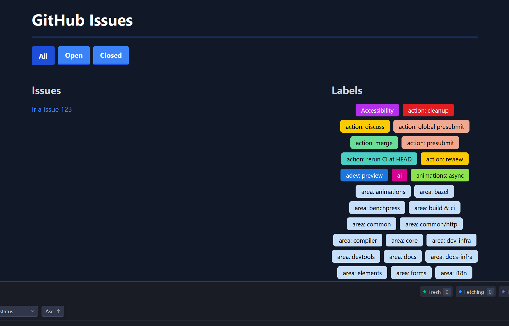

# 🏷️ Apuntes: Labels dinámicos en Angular con Tailwind + Variables CSS

Implementar labels dinámicos en Angular con Tailwind, variables CSS y lógica para el contraste de color.



## 📑 Índice

1. [Objetivo](#objetivo)
2. [Vista HTML (template)](#vista-html-template)
3. [Componente TypeScript](#componente-typescript)
4. [Estilos con variables CSS](#estilos-con-variables-css)
5. [Explicación paso a paso](#explicación-paso-a-paso)
6. [Resultado esperado](#resultado-esperado)

---

## 🎯 Objetivo

* Mostrar **labels dinámicos** con su color de fondo recibido de GitHub.
* Ajustar automáticamente el **color del texto** para mantener contraste (blanco o negro).
* Aplicar **hover dinámico** usando **variables CSS** (`--label-bg`, `--label-text`).

---

## 📄 Vista HTML (template)

```html
<div class="flex flex-wrap justify-center items-center gap-2">
  @for(label of labels(); track label.id) {
    <span
      id="label-{{label.id}}"
      class="inline-flex items-center px-3 py-1 border rounded-md text-sm font-medium cursor-pointer transition-colors duration-200"
      [style.--label-bg]="'#' + label.color"
      [style.--label-text]="getTextColor(label.color)"
      style="border-color: var(--label-bg); background-color: var(--label-bg);"
      [ngStyle]="{ 'color': getTextColor(label.color) }"
    >
      {{ label.name }}
    </span>
  }
</div>
```

🔹 Puntos clave:

* `id="label-{{label.id}}"` → da un identificador único por label.
* `[style.--label-bg]` → define una **variable CSS dinámica** con el color de fondo.
* `[style.--label-text]` → define otra variable CSS para el color de texto.
* `[ngStyle]` → aplica directamente el color calculado al texto.

> Nota: Si se elimina `background-color: var(--label-bg);`de la propeidad `style` y el `[ngStyle]` también se elimina, se podra ver el efecto de `hover`.
---

## ⚙️ Componente TypeScript

```ts
import { Component, input, OnInit } from '@angular/core';
import { GitHubLabel } from '../../interfaces/github-label.interface';
import { NgStyle } from '@angular/common';

@Component({
  selector: 'issues-labels-selector',
  templateUrl: './labels-selector.component.html',
  styleUrls: ['./labels-selector.component.css'],
  imports: [NgStyle]
})
export class LabelsSelectorComponent implements OnInit {

  public labels = input.required<GitHubLabel[]>();

  constructor() { }

  ngOnInit() {}

  /**
   * Determina el color del texto (blanco o negro)
   * según el contraste con el color de fondo (hex).
   */
  public getTextColor(hex: string): string {
    if (!hex) return 'black';

    // Quitar "#" si existe
    const c = hex.startsWith('#') ? hex.substring(1) : hex;

    // Convertir HEX → RGB
    const r = parseInt(c.substring(0, 2), 16);
    const g = parseInt(c.substring(2, 4), 16);
    const b = parseInt(c.substring(4, 6), 16);

    // Algoritmo YIQ para luminancia
    const yiq = (r * 299 + g * 587 + b * 114) / 1000;

    return yiq >= 128 ? 'black' : 'white';
  }
}
```

🔹 Así garantizamos que:

* Fondos claros → texto negro.
* Fondos oscuros → texto blanco.

---

## 🎨 Estilos con variables CSS

```css
/* Afecta solo a los elementos con id que empiecen por "label-" */
[id^="label-"]:hover {
  background-color: var(--label-bg); /* usa la variable CSS */
  color: var(--label-text);         /* usa la variable CSS */
}
```

👉 Con `[style.--label-bg]` y `[style.--label-text]`, cada `<span>` define sus **propias variables CSS**.
El hover toma esas variables dinámicamente.

---

## 📝 Explicación paso a paso

1. **Se cargan los labels desde GitHub** (incluyen `name` y `color`).
2. En el **template** se construye un `<span>` por cada label.
3. Angular inyecta:

   * `--label-bg`: color de fondo dinámico.
   * `--label-text`: color de texto calculado.
4. En el **componente**, `getTextColor` aplica un algoritmo YIQ para decidir entre blanco/negro.
5. En los **estilos**, la pseudoclase `:hover` usa `var(--label-bg)` y `var(--label-text)` para invertir los estilos.

---

## ✅ Resultado esperado

* Cada etiqueta se muestra con el color que devuelve GitHub.
* El texto es **legible siempre** (blanco o negro según el fondo).
* Al pasar el mouse, el fondo y el texto cambian usando las variables CSS.

---

