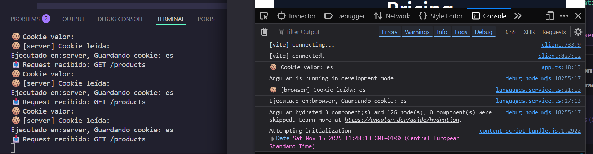
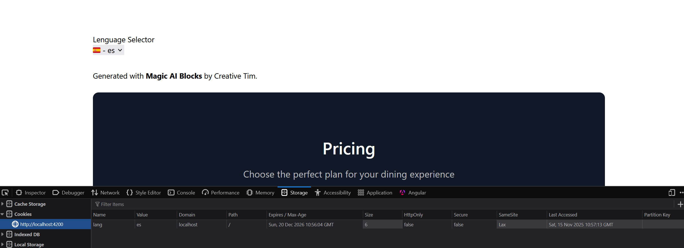

# Internazionalización con i18n con `@ng-translate` con `@ng-cookie-server`

[1 Configuración de Cookies/Headers Personalizados en Angular
](#-configuración-de-cookiesheaders-personalizados-en-angular)

[2 Trabajando con Cookies en Angular](#-trabajando-con-cookies-en-angular)
[2.1 Usando Document (Nativo)](#1-usando-document-nativo)
[2.2 Usando ngx-cookie-service](#2-usando-ngx-cookie-service)
[2.3 Usando ngx-cookie-service-ssr](#3-usando-ngx-cookie-service-ssr)
[3 Incorporar `ngx-transalate`]

## 🔧 Configuración de Cookies/Headers Personalizados en Angular

Si tu servicio backend utiliza nombres diferentes para la cookie o header del token XSRF, puedes usar `withXsrfConfiguration` para sobrescribir los valores por defecto.

Su configuración básca es la siguiente:

````typescript
// app.config.ts
import { ApplicationConfig } from '@angular/core';
import { provideHttpClient, withXsrfConfiguration } from '@angular/common/http';

export const appConfig: ApplicationConfig = {
  providers: [
    provideHttpClient(
      withXsrfConfiguration({
        cookieName: 'CUSTOM_XSRF_TOKEN',     // Nombre personalizado de la cookie
        headerName: 'X-Custom-Xsrf-Header',  // Nombre personalizado del header
      }),
    ),
  ]
};
````

## 🍪 **Trabajando con Cookies en Angular**

### **1. Usando Document (Nativo)**

Enalce oficial: [angular](https://angular.dev/best-practices/security#configure-custom-cookie-header-names)

Se basa en usar el servicio de `DOCUMENT`, donde se gurarda información en la propeiad `cookie`, con el formato:

cookie = `key=[value][expired];path=/;`

Ejemplo:
````typescript
// cookie.service.ts
import { Injectable, Inject } from '@angular/core';
import { DOCUMENT } from '@angular/common';

@Injectable({
  providedIn: 'root'
})
export class CookieService {
  
  constructor(@Inject(DOCUMENT) private document: Document) {}

  // 📖 Leer cookie
  getCookie(name: string): string | null {
    const nameEQ = name + "=";
    const ca = this.document.cookie.split(';');
    
    for (let i = 0; i < ca.length; i++) {
      let c = ca[i];
      while (c.charAt(0) === ' ') c = c.substring(1, c.length);
      if (c.indexOf(nameEQ) === 0) return c.substring(nameEQ.length, c.length);
    }
    return null;
  }

  // ✍️ Escribir cookie
  setCookie(name: string, value: string, days?: number): void {
    let expires = "";
    if (days) {
      const date = new Date();
      date.setTime(date.getTime() + (days * 24 * 60 * 60 * 1000));
      expires = "; expires=" + date.toUTCString();
    }
    this.document.cookie = name + "=" + value + expires + "; path=/";
  }

  // 🗑️ Eliminar cookie
  deleteCookie(name: string): void {
    this.setCookie(name, "", -1);
  }
}
````

### **2. Usando ngx-cookie-service**

> Link del paquete [ngpx-cookie-service](https://www.npmjs.com/package/ngx-cookie-service/v/12.0.0)

Librería de terceros disponible en `npm`, muy usada.

Se basa en instlar el paquete, e importar el servicio `cookie`, para gestionar las cookies. La información se almacena como pares de valores:

`cookie.set(name,value,expires)`

Ejemplo:

1. Instalar dependencia:
````bash
# Instalación
npm install ngx-cookie-service
````

> Nota: Requirirá proveer el servicio en la modulo o componente standaolne donde se usa.

2. Proveer servicio en Angular Standalone
````typescript
// app.config.ts
import { provideNgxCookieService } from 'ngx-cookie-service';

export const appConfig: ApplicationConfig = {
  providers: [
    // ...otros providers
    provideNgxCookieService(),
  ]
};
````

3. Uso del serivcio en un compoennte standalone
````typescript
// component.ts
import { CookieService } from 'ngx-cookie-service';

@Component({
  selector: 'app-example',
  template: `
    <button (click)="setCookie()">Guardar Cookie</button>
    <button (click)="getCookie()">Leer Cookie</button>
    <button (click)="deleteCookie()">Eliminar Cookie</button>
    <p>Valor: {{ cookieValue }}</p>
  `
})
export class ExampleComponent {
  cookieValue: string = '';

  constructor(private cookieService: CookieService) {}

  // ✍️ Guardar cookie
  setCookie(): void {
    this.cookieService.set('miCookie', 'valor ejemplo', 7); // 7 días
  }

  // 📖 Leer cookie
  getCookie(): void {
    this.cookieValue = this.cookieService.get('miCookie');
  }

  // 🗑️ Eliminar cookie
  deleteCookie(): void {
    this.cookieService.delete('miCookie');
    this.cookieValue = '';
  }
}
````

### **3. Usando ngx-cookie-service-ssr**

Link del paquete: [ng-cookie-service-ssr](https://www.npmjs.com/package/ngx-cookie-service-ssr)

Librearía de terceros, usada para manejar de forma sencilla las cookies en apliaciones angualr ssr.

Ejemplo:

1. Instalar paquete.

```bash
npm i ngx-cookie-service-ssr
```
> Requeríra proveer el servicio en el módulo o componente standolone afectado.

2. Cargar servicio en Angular Standalone (_recomenado, aunque esta provido en el root y no es necesario_).

```ts
// app.config.ts
import {SsrCookieService} from 'ngx-cookie-service-ssr';

export const appConfig: ApplicationConfig = {
  providers: [
    // ...otros providers
    SsrCookieService
  ]
};
```

3. Modificar el archivo `server.ts` o `app.confing.server.ts`, en applicaciones de srr, para habilitar las cookies 

_consiste en añadir unos providers, básciamente:_

```json
//...
{
    // ...
    providers: [
        //..
    { provide: 'REQUEST', useValue: req },
    { provide: 'RESPONSE', useValue: res }
    ]
}
```      

_En Angular 17 o inferior, lo configuramos en `server.ts`_ 
```ts
server.get('*', (req, res) => {
  res.render(indexHtml, {
    req,
    providers: [
      { provide: APP_BASE_HREF, useValue: req.baseUrl },
      { provide: 'REQUEST', useValue: req },
      { provide: 'RESPONSE', useValue: res },
    ],
  });
```

_En Angular 18+, si necesitas agregar providers personalizados lo configuramos en `app.config.server.ts` en lugar del archivo server.ts`


```ts
// app.config.server.ts
import { mergeApplicationConfig, ApplicationConfig, inject, REQUEST, RESPONSE_INIT, PLATFORM_ID } from '@angular/core';
import { provideServerRendering, withRoutes } from '@angular/ssr';
import { appConfig } from './app.config';
import { serverRoutes } from './app.routes.server';

const serverConfig: ApplicationConfig = {
  providers: [
    provideServerRendering(),provideServerRendering(), // aqui añadir las routes del servidor mediante `withRoutes()`
    // 🆕 Aquí agregas tus providers personalizados para SSR
    {
      provide: 'REQUEST',
      useFactory: () => inject(REQUEST, { optional: true })
    },
    {
      provide: 'RESPONSE',
      useFactory: () => inject(RESPONSE_INIT, { optional: true })
    }
  ]
};

export const config = mergeApplicationConfig(appConfig, serverConfig);

```
> 
> 🎯 **¿Por qué cambió esto?**
> 
> | Aspecto | Angular 17- (Antiguo) | Angular 18+ (Nuevo) |
> |---------|----------------------|---------------------|
> | **Engine** | Universal Express Engine | AngularNodeAppEngine |
> | **Configuración** | En server.ts | En app.config.server.ts |
> | **Providers** | En res.render() | En ApplicationConfig |
> | **Flexibilidad** | Menos | Más modular y flexible |
>
> Sin embargo, hemos probado y no es necesario en angular 20, y se esta cargando bien la cookie sin los providers REQUEST y RESPONSE, tanto usando en cliente como en el servidor


4. Agregar item en las cookies:

```ts
export type LANGUAGE = 'en' | 'es' | 'fr' ;

@Injectable({
  providedIn: 'root'
})
export class LanguagesService {

  private cookie = inject(SsrCookieService);

  private readonly SUPPORTED_LANGUAGES: LANGUAGE[] = ['en', 'es', 'fr'];

  private cookieEffect = effect( () ={
    console.log('Cookie leida: '+ this.cookie.get('lang'));
  })

  constructor() { }

  changeLanguage(lang: LANGUAGE) {
    console.debug('Lenguaje cambiado en el servicio:', lang);

    //  Agregar cookie
    //    this.cookie.set('lang', lang);
    this.cookie.set('lang',lang, {expires: 3*24*60*60}); // 3 dias
  }
}
```

**IMPORTATE** Bug en `ngx-cookie-server-ssr`

Esto hara que se guarde la COOKIE en el navegador, pero en el servidor node que guarda, ni lee, es decir, `this.cookie.get('lang') = ''`, cuando se ejecuta en `server`, lo que implicará realizar una modificación.





# 3. Incorporar `ngx-transalate`

Con la dependneica `ngx-translate`, damos soporte a la internazionalización (i18n) para  ser implementada de forma sencilla, el problema es que se basa en modulos por lo que se debe adaptar en apliacioens standalone.

Web oficial: https://ngx-translate.org/
Paquete npm: https://www.npmjs.com/package/@ngx-translate/core
Babel edit: https://www.codeandweb.com/babeledit

1. Instalar la dependencia.

```bash
# Verificar si están instaladas:
../i18n-app>npm list @ngx-translate/core @ngx-translate/http-loader

# Si no están instaladas:
../i18n-app>npm install @ngx-translate/core @ngx-translate/http-loader
```

2. Cargar el modulo en `app.config.ts`

```ts
export const appConfig: ApplicationConfig = {
  providers: [
    provideBrowserGlobalErrorListeners(),
    provideZoneChangeDetection({ eventCoalescing: true }),
    provideRouter(routes), provideClientHydration(withEventReplay()),

    // Configruacion global de servicios
    // 🍪 Cookies SSR
    SsrCookieService,

    /** Configuracion para ng-transalte */
    // 🌐 HTTP Client (necesario para ngx-translate)
    provideHttpClient( withFetch() ),

    // 🌍 NGX-Translate
    /** Configuracion para ng-transalte */
    // 🌐 HTTP Client (necesario para ngx-translate)
    provideHttpClient( withFetch()),

    // 🌍 NGX-Translate
    provideTranslateService({
     lang: 'en',
     fallbackLang: 'en',
     loader: provideTranslateHttpLoader({
       prefix: '/i18n/',
       suffix: '.json'
     })
    }),

  ]
};
```

3. Crear estrucutra de archvios

> Nota: Puedes usar `BabelEdit`, para generar los ficheros con las traducciones
```bash
# Crear carpeta de traducciones
mkdir -p i18n-app/public/assets/i18n

# Crear archivos de ejemplo
echo '{"HELLO": "Hello", "WELCOME": "Welcome to our app!"}' > 18n-app/public/assets/i18n/en.json
echo '{"HELLO": "Hola", "WELCOME": "¡Bienvenido a nuestra aplicación!"}' > 18n-app/public/assets/i18n/es.json
echo '{"HELLO": "Bonjour", "WELCOME": "Bienvenue dans notre application!"}' > 18n-app/public/assets/i18n/fr.json
```

# Aneox: 🔒 **Mejores prácticas de seguridad**

````typescript
// secure-cookie.service.ts
@Injectable()
export class SecureCookieService {
  
  // ✅ Cookie segura con opciones avanzadas
  setSecureCookie(name: string, value: string, options?: {
    expires?: number;
    secure?: boolean;
    httpOnly?: boolean;
    sameSite?: 'strict' | 'lax' | 'none';
  }): void {
    let cookieString = `${name}=${value}`;
    
    if (options?.expires) {
      const date = new Date();
      date.setTime(date.getTime() + (options.expires * 24 * 60 * 60 * 1000));
      cookieString += `; expires=${date.toUTCString()}`;
    }
    
    if (options?.secure) cookieString += '; secure';
    if (options?.httpOnly) cookieString += '; httpOnly';
    if (options?.sameSite) cookieString += `; sameSite=${options.sameSite}`;
    
    cookieString += '; path=/';
    document.cookie = cookieString;
  }
}
````

Probar la apalicacion
```bash
// Limpiar
npx ng cache clean

# Desarrollo
npx npm run start

# Build y servidor SSR
npm run build
npx npm run serve:ssr:i18n-app
```